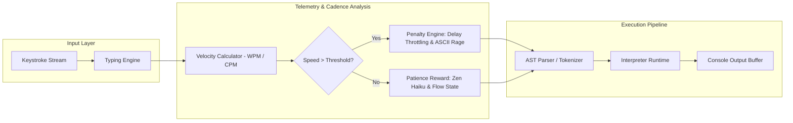

# Architecture & Execution Runtime

## Overview
`slowlang` (TortoiseLang) is an intentional, patience-oriented programming runtime that throttles typing velocity and enforces mindfulness through interactive execution feedback, sarcastic telemetry, and delay penalties.

---

## Architectural Decision Records (ADRs)

### ADR-001: Real-Time Event-Driven Keystroke Interceptor
* **Status**: Accepted
* **Context**: Traditional linters only analyze code post-edit; patience enforcement requires live rhythm monitoring.
* **Decision**: Build an event-driven `TypingEngine` calculating rolling average intervals between consecutive keypresses (`delta_ms`).
* **Consequences**: Immediate behavioral feedback with zero perceivable rendering latency.

### ADR-002: Modular Penalty & Sarcasm State Machine
* **Status**: Accepted
* **Context**: Feedback must scale dynamically with developer impatience.
* **Decision**: Implement state machine with 4 escalations: `Zen` -> `Warning` -> `Sarcastic Intervention` -> `Angry Turtle ASCII Lockout`.
* **Consequences**: Humorous, gamified feedback loop that enforces typing rate limits cleanly.
