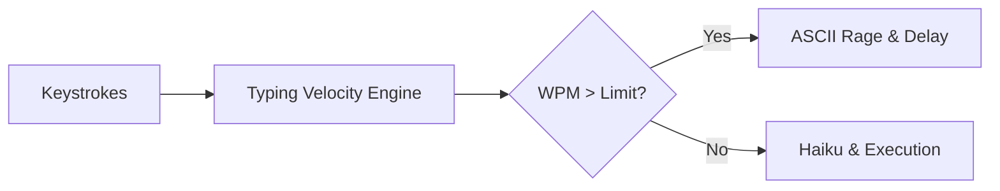

# 🐢 slowLang – Slower is Better

A **sarcastic programming language** and IDE that throws errors if you type too fast.  
Complete with a screaming ASCII turtle, poetic output, and a sassy, minimalistic Python IDE.  
Why rush, when your code can feel... meaningful?

---

## 🧠 Basic Details

### Team Name: XYZ

### Team Members
- Team Lead:  **Sebin Mathew** – College of Engineering Chengannur  
- **Abin Zachariah Abraham** – College of Engineering Chengannur

---

## 🚫 The Problem (that doesn't exist)

Most programming languages focus on speed, efficiency, and productivity,  
leading to stressful coding habits and unrealistic expectations on typing speed.

---

## ✅ The Solution (that nobody asked for)

**slowLang** introduces a language and IDE that enforces slow, mindful typing.  
Typing too fast results in errors and angry turtle ASCII feedback.  
It promotes *"patience-oriented programming"* with haikus, delays, and sarcastic praise.

---

## 🔧 Technologies / Components Used

### Software:
- Python (for IDE and core logic)
- Tkinter (for the fake IDE UI)

### Libraries:
- keyboard
- time
- rich
- os, sys, re, argparse *(optional)*
- VS Code + Extensions

---

## ⚙️ Installation

```bash
pip install keyboard time rich
```

> Tkinter comes with Python by default.

---

## ▶️ How to Run

### **Start the IDE:**

```bash
python ui-fakeide.py
```

#### **IDE Features:**
- **Live typing speed enforcement:**  
  Type too fast and a turtle rage window will pop up with sarcastic feedback.
- **Run code like Python:**  
  Use the "Run (like Python)" button to execute your code directly in the IDE.
- **Python color scheme and smart indentation:**  
  The editor highlights Python keywords, strings, comments, and builtins, and auto-indents after colons for blocks.
- **Turtle moods:**  
  Different ASCII turtles for "too fast", "just right", and "too slow" typing.
- **Intro popup:**  
  Shows a summary of features before you start coding.
  - **Wisdom:**
  • The compiler will sometimes pop words of wisdom after execution.

---

## 🐢 Language & IDE Features

- **Python-like syntax:** Write and run code just like Python.
- **Speed enforcement:** Typing too fast triggers sarcastic errors and turtle rage (in a popup window in the IDE).
- **Sarcastic feedback:** Get sassy remarks and poetic haikus if you break the rules.
- **Fake IDE:** Includes a Tkinter-based IDE with live feedback, Python color scheme, and smart indentation.
- **No PDF export, no .slow interpreter:** All code is written and run directly in the IDE for a seamless, fun experience.

---

## 🧪 How to Test the IDE

1. **Start the IDE:**
   ```bash
   python ui-fakeide.py
   ```

2. **Type your code** in the editor window.  
   - If you type too fast, a turtle rage popup will appear and sarcastic feedback will be shown.
   - If you slow down, the turtle will be happy.
3. **Run your code:**
   - Click "Run (like Python)" to execute your code in the IDE.  

---

## 📝 Example Code

```python
print("Hello, world!")
for i in range(3):
    print(i)
print("Done!")
```

---

## 🖼️ Screenshots

  
*Fake IDE window with turtle ASCII reacting to fast typing.*

  
*Sarcastic error: "Whoa there, Shakespeare. Try again... slower."*

  
*"Compiled" poetic output of slow-written code.*

### 📹 Video

[Demo Video Link](https://drive.google.com/file/d/1TNppWuXmuvZx9n56Ch_TeUyTyqBg0qDJ/view?usp=sharing)
---

## 🧑‍🤝‍🧑 Team Contributions

* **Sebin Mathew** – Typing speed engine, sarcasm handler, turtle rage ASCII
* **Abin Zachariah Abraham** – Fake IDE window UI, poetic output, emoji benchmark spoof

---

## 🧑‍🎓 What We Learned

- **UI/UX matters, even for joke projects:**  
  Making a fun, interactive, and visually engaging IDE (with popups, color schemes, and ASCII art) is as important as the core logic.
- **Python’s Tkinter is powerful and flexible:**  
  We learned how to build a custom code editor with syntax highlighting, smart indentation, and dynamic feedback using only standard libraries.
- **Injecting humor into code is a design challenge:**  
  Balancing sarcasm, fake delays, and playful feedback without frustrating the user too much required careful tuning.
- **Code structure and modularity:**  
  Separating sarcasm, ASCII art, and UI logic into different files made the project easier to maintain and extend.
- **Testing for edge cases:**  
  We had to handle cases like re-enabling the editor after errors, and making sure the turtle’s moods always matched the user’s typing speed.
- **Collaboration and version control:**  
  Using GitHub for collaboration, code reviews, and version management helped us work efficiently as a team.

---

Made with ❤️ at TinkerHub Useless Projects


---

## 📐 System Architecture

`slowlang` uses a real-time event-driven engine to monitor keystroke velocity and enforce cadence:



Detailed state machine diagrams and runtime architecture documented in [ARCHITECTURE.md](./ARCHITECTURE.md).

## 🔒 Security

This repository uses [gitleaks](https://github.com/gitleaks/gitleaks) for automatic secret scanning on every commit.

### Pre-commit Hook

A pre-commit hook is configured to scan for secrets before each commit. This helps prevent accidentally committing sensitive information like:
- API keys
- Passwords
- Tokens
- Private keys

### Setup

To enable the pre-commit hook locally:

```bash
# Install pre-commit
pip install pre-commit

# Install hooks
pre-commit install
```

### Bypass (Emergency Only)

In case of emergency, you can bypass the hook:

```bash
git commit --no-verify -m "emergency commit"
```

> ⚠️ Only use `--no-verify` in emergency situations. Regular commits should always be scanned.

